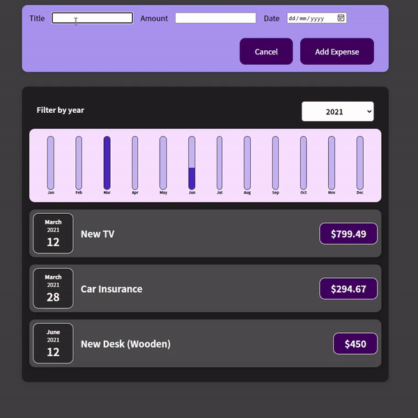

<p align="center">
  <p align="center">
    A web-app helps you track down your expenses
    <br>
    Expenses Tracker
  </p>
</p>


## Table of contents

- [What's included](#whats-included)
- [Creators](#creators)


## What's included

<p align="center">
  
</p>

File Structure

```text
src/
├──  App.js
├──  index.css
├── index.js
└── components/
    ├── Chart/
    │   ├── Chart.css
    │   ├── Chart.js
    │   ├──ChartBar.css
    │   └── ChartBar.js
    ├──Expenses/
    │   ├── ExpenseDate.css
    │   ├── ExpenseDate.js
    │   ├── ExpenseItem.css
    │   ├── ExpenseItem.js
    │   ├── Expenses.css
    │   ├── Expenses.js
    │   ├── ExpensesChart.js
    │   ├── ExpensesList.css
    │   └── ExpensesList.js
    ├── ExpensesFilter/       
    │   ├── ExpensesFilter.css
    │   └── ExpensesFilter.js
    ├── NewExpense/
    │   ├── ExpenseForm.css
    │   ├── ExpenseForm.js
    │   ├── NewExpense.css
    │   └── NewExpemse.js
    └── UI/
        ├── Card.css
        └── Card.js
    
```


## Creators

**Creator 1**

- <https://github.com/nguyenxuongkim2103>


Enjoy :metal:
